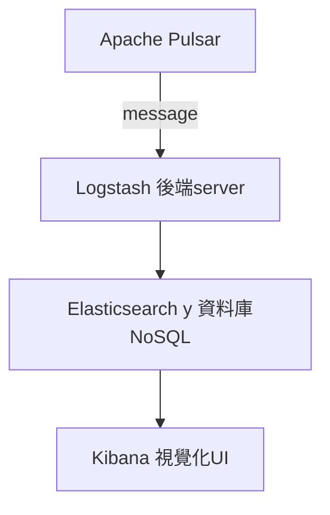
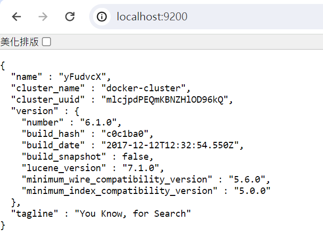
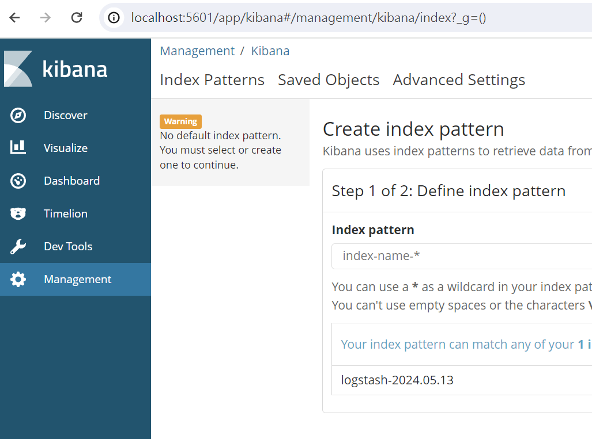

## 期末報告架構(未完成)
目前只有空空的Elastic Stack
Elastic Stack會當作期末報告的UI和資料庫
### To Do List
研究以下這些連結
```
Logstash作為consumer訂閱topic
https://github.com/streamnative/logstash-input-pulsar

認識Elastic Stack跟logging的關係
這包docker compose也是從這個連結抄的
https://github.com/twtrubiks/docker-elk-tutorial
```


### 佈署流程
請在wsl、linux、mac上執行(mac環境問題請自行處理)
```
cd docker-elk
docker-compose up -d
```
### 測試運行
用瀏覽確認localhost:9200有沒有正常運行(Elasticsearch)


用瀏覽確認localhost:5601有沒有正常運行(Kibana)

