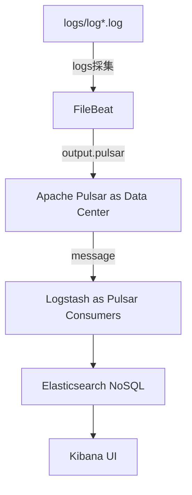
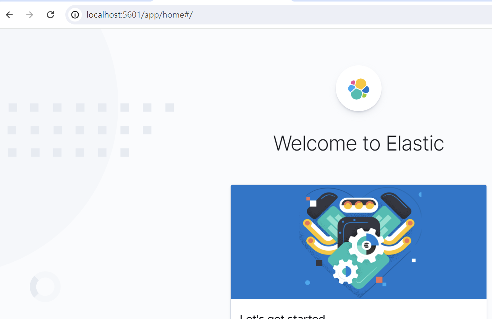
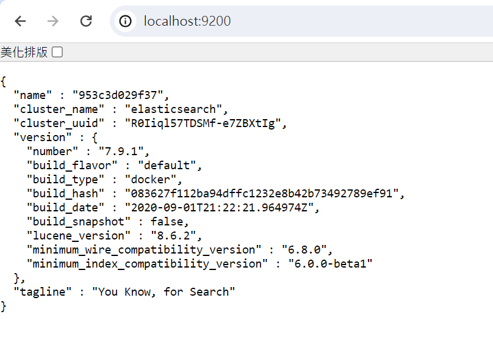

## 期末報告架構(未完成)
目前只有空空的Elastic Stack
Elastic Stack會當作期末報告的UI和資料庫
### To Do List
研究以下這些連結
```
Logstash作為consumer訂閱topic
https://github.com/streamnative/logstash-input-pulsar

認識Elastic Stack跟logging的關係
這包docker compose也是從這個連結抄的
https://github.com/twtrubiks/docker-elk-tutorial
```


### Pulsar佈署流程
請在wsl、linux、mac上執行(mac環境問題請自行處理)
啟動Apache Pulsar
```
若docker沒自動啟動
ulimit -n 65536
service docker start

cd pulsar
sudo mkdir -p ./data/zookeeper ./data/bookkeeper
sudo chown -R 10000 data
docker-compose up -d
```
### 測試運行
如有版本問題建議安裝nvm管理
```
cd npm_client
nvm install 18 (option)
nvm use 18.X.X (option)
npm install
node index.js 或 npm start
```

### Elastic
啟動Elastic Stack
```
cd elastic
docker-compose up -d
```
### 測試運行
用瀏覽確認localhost:9200有沒有正常運行(Elasticsearch)

用瀏覽確認localhost:5601有沒有正常運行(Kibana)


### Logging
service logs 會存在logs資料夾裡
```
cd logging_test
npm install
node index.js 或 npm start
打http://localhost:3000 GET
```

### Filebeat蒐集logs
Filebeat會從logs資料夾撈新的log
只要資料有更新就會做撈取
```
cd filebeat
docker compose up -d
若想看log資料有沒有抓進去 可以用
docker compose up
docker logs <ID>
```
